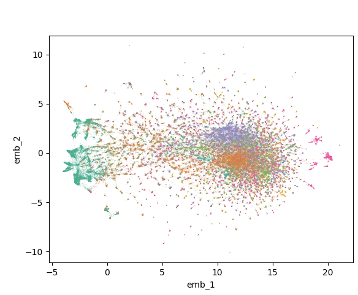

# Sentiment Review of 6 Different Apps
## Sentiment analysis of 6 second-hand clothing apps.

This project uses NLP methods to analyzes reviews pulled from 6 apps on the google play cloud service. 

The companies are:
* Depop
* Poshmark
*  ThredUP
*  Tradesy
*  Vestiaire Collective
*  Vinted

The goal is to discover how people feel about these different apps over time so that a new company entering the industry or an existing company can implement well liked practices and avoid critical issues that cause disapproval.

This would have the effect of positively bolstering the company's reputation which has multiple downstream positive effects.

The code can easily be adapted to include more apps as well analyzing different industries.

Using the graph below, we can look at time intervals with usually high or low sentiment and then a deeper analysis can be done on those time selected comments to discover what consumers like and don't like.

## Topic Modeling
A topic modelling of all 200,000+ reviews was done using Top2Vec and then a hierarchical model reduction was done so that 12 topic clusters could be created.

